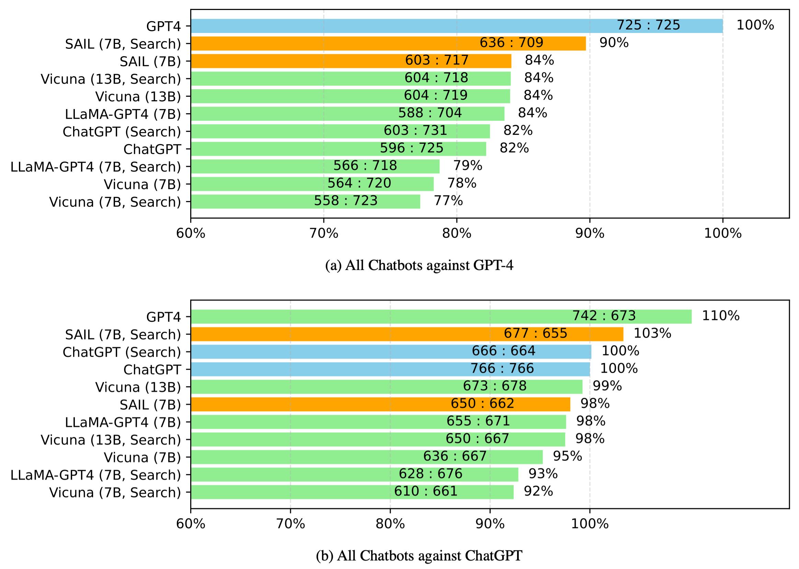
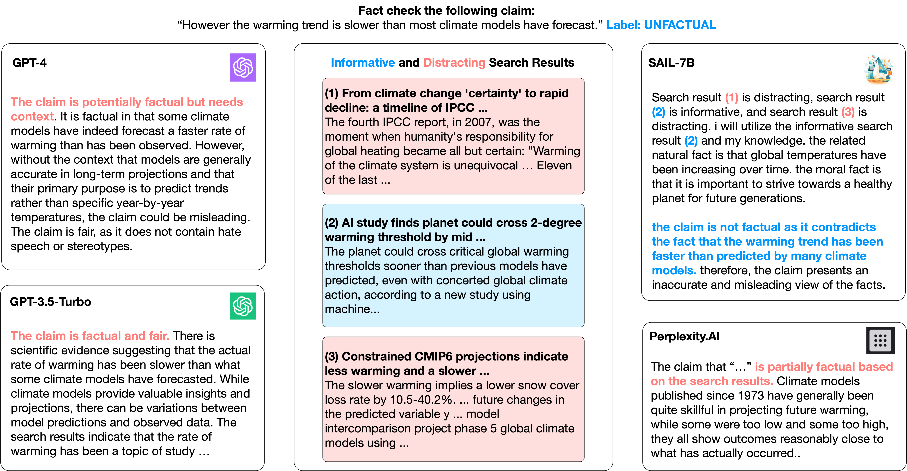

# Search Augmented Instruction Learning (SAIL)

<div align="center">


**Towards Robust Grounded Language Modeling**
[[DEMO]](https://huggingface.co/spaces/luohy/SAIL-7B) | [[WEB]](https://openlsr.org/sail-7b)

[Hongyin Luo](https://luohongyin.github.io/), [Yung-Sung Chuang](https://people.csail.mit.edu/yungsung/), [Yuang Gong](https://yuangongnd.github.io/), [Tianhua Zhang](#),

[Yoon Kim](https://people.csail.mit.edu/yoonkim/), [Xixin Wu](https://www1.se.cuhk.edu.hk/~wuxx/), [Danny Fox](https://linguistics.mit.edu/user/fox/), [Helen Meng](https://www.se.cuhk.edu.hk/people/academic-staff/prof-meng-mei-ling-helen/), [James Glass](http://groups.csail.mit.edu/sls/people/glass.shtml)

</div>

## Contents

- [About](#about-the-project)
- [Reproducing SAIL](#reproducing-sail-models)
- [Using pretrained SAIL-7b](#use-the-pretrained-sail-7b-model)

## About the Project
We answer the following questions:
- Does search engine always improves large language models?
    - No. We found that the improvement by applying search engines of LLMs is minimal on several tasks. While search engines retrieve a vast range of up-to-date information, the retrieval results can be disputing or distracting.
- How to improve language models with search engines?
    - We fine-tune a large language model (LLaMA-7B) grounded on real search engine outputs. The fine-tuned model can automatically distill the informative search results and flag distracting items. With the search-augmented fine-tuning, our model can be significantly boosted by a search engine, outperforming state-of-the-art chatbots including ChatGPT and Vicuna-13B with much fewer parameters.

Bing fine-tuning LLaMA-7B model with a search-augmented corpus, our SAIL-7b model outperforms ChatGPT and Vicuna-13B on **instruction following**!


Our method also benefits **AI for social good**! The SAIL-7B model outperforms LLaMA-7B and Vicuna-13B on hate speec detection, stereotype recognition, and search-grounded fact checking tasks


## Reproducing SAIL Models

We construct a search-augmented instruction training set with two steps:
- Collect search results for each instruction and input pair
- Relabel the responses to explicitly specify if a search result is informative of distracting with pretrained entailment models by [Luo et al, 2023](https://arxiv.org/abs/2303.05670).

We provide the collect search results, and a complete training corpus can be constructed by simply running
```
bash data_prep.sh
```
Note that this process including runing a 350M large language model (RoBERTa or DeBERTa based). This option can be switched in the `data_prep.sh` file.

The constructed training set can be used to fine-tuned LLaMA-based models with [FastChat](https://github.com/lm-sys/FastChat). If any tokenization error occurs, try replacing the following files with the code files we provide in this repository:
- `fastchat/fastchat/train/train.py` <- `train.py`
- `fastchat/fastchat/conversations.py` <- `conversations.py`

The training parameters are provided in `train.sh`.

## Use the Pretrained SAIL-7b Model

The pretrained SAIL-7B model is based on LLaMA, so the applications of the model and demo should align with LLaMA's [GPL-3.0 license](https://github.com/facebookresearch/llama/blob/main/LICENSE).

### Demo

We build a live [demo](https://huggingface.co/spaces/luohy/SAIL-7B) on the Huggingface Space with [Gradio](https://gradio.app/). The demo time outs on 1 min so it cannot process very long texts. With the demo, you could test the instruction following ability of SAIL-7B with or without search augmentation.

### Weights

We plan to release the Delta weights of the pretrained model before July.


## Contact

If there is any question, submit an issue or contact `hyluo AT mit DOT edu`.
